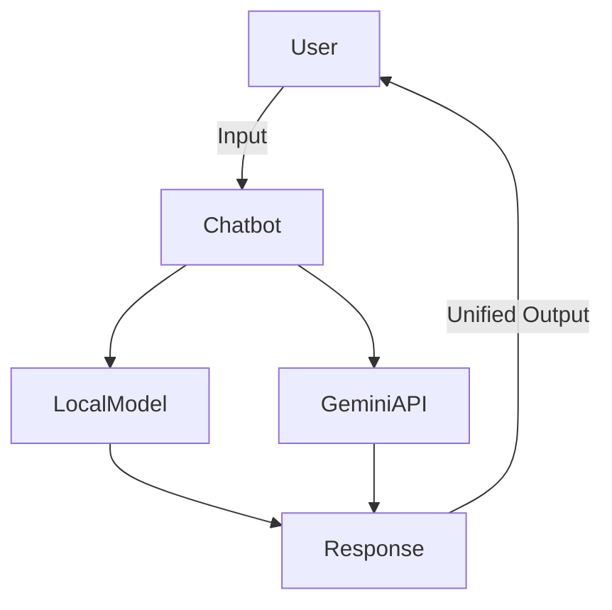

# 🧠 AI Mental Health Therapist Chatbot

An empathetic, AI-powered mental health companion built using machine learning and natural language processing. This chatbot listens, responds, and guides users through emotional challenges — all while preserving privacy and promoting mental well-being.

---

## 🌟 Features

- 🤖 Fine-tuned transformer model on mental health datasets
- 💬 Emotionally supportive and empathetic responses
- 🛠️ Dual-model inference (Local + Gemini API)
- 🚨 Crisis detection & severity-based responses
- 📊 Evaluated for grammar, relevance, and coherence
- 🧼 Cleaned and privacy-respecting codebase

---

## 🧪 Datasets Used

- [MentalHealth16k](https://huggingface.co/datasets/your-link)
- Reddit mental health dataset (custom preprocessed)
- Augmented prompts for instruction-style fine-tuning

---

## 🛠️ Tech Stack

| Component        | Stack/Library                       |
|------------------|-------------------------------------|
| Language Model   | Hugging Face Transformers           |
| Fine-tuning      | PyTorch, Datasets                   |
| Web Interface    | Taipy                               |
| Deployment       | Discord Bot (Free Hosting)          |
| API Integration  | Gemini API                          |

---

## ⚙️ How It Works



---

## 🚨 Crisis Detection

Detects high-risk phrases like:
- "I feel like giving up"
- "I'm not okay"
- "hurting myself"

🔒 The bot responds empathetically and suggests helplines/resources.  
**No personal data is stored.**

---

## 📁 Project Structure

```
mental-health-chatbot/
├── config/                   # Configs & .env.example
├── data/                     # Cleaned/preprocessed datasets
├── src/                      # Source code
│   ├── inference.py          # Main logic for response generation
│   ├── data_collection.py    # Reddit API integration
│   ├── crisis_detection.py   # Detect & respond to crisis inputs
│   └── gemini_integration.py # Gemini response generation
├── requirements.txt
├── README.md
└── .gitignore
```

---

## 🚀 Getting Started

### 🔧 Installation

```bash
git clone https://github.com/Ashh-2004/AI-Mental-Health-Therapist-Chatbot.git
cd AI-Mental-Health-Therapist-Chatbot
pip install -r requirements.txt
```

### 🧪 Environment Setup

Create a `.env` file based on `.env.example`:

```env
REDDIT_CLIENT_ID=your_client_id
REDDIT_SECRET=your_client_secret
GEMINI_API_KEY=your_gemini_key
```

---

## 🤝 Contributing

Contributions, suggestions, and issues are welcome!  
Open a pull request or start a discussion 💬

---

## 🧘 Ethics & Disclaimer

This bot is for **support and companionship** only.  
It does **not replace professional mental health services**.  
If you're in crisis, please contact local authorities or helplines.

---

## 📜 License

MIT License © [Ashish (Ashh-2004)](https://github.com/Ashh-2004)
